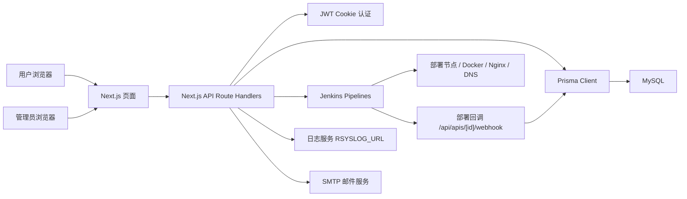

# 项目架构分析

本文档基于当前仓库静态分析生成，只描述现状，不修改业务代码。

## 1. 技术栈

### 前端

- Next.js 15.5.4，使用 App Router。
- React 19.1.1 / React DOM 19.1.1。
- Tailwind CSS 4.x，配合 `postcss.config.mjs` 和 `tailwind.config.js`。
- 页面代码同时存在 `.tsx` 与 `.js`，`tsconfig.json` 中开启了 `allowJs`。

### 后端

- Next.js Route Handlers，接口集中在 `src/app/api/**/route.js`。
- JWT 登录态，用户与管理员分别使用 `user-token` 和 `admin-token` cookie。
- `bcryptjs` 用于密码哈希。
- `nodemailer` 用于注册验证邮件和部署状态邮件。
- 原生 `fetch` 调用 Jenkins、日志服务等外部系统。

### 数据层

- Prisma 6.16.2。
- MySQL，连接串来自 `DATABASE_URL`。
- 主要模型：
  - `Admin`：后台管理员。
  - `User`：平台用户、邮箱验证状态、配额。
  - `Api`：用户部署的 API 应用。
  - `ApiInfor`：API 的部署节点、端口、服务器信息。
  - `Database`：用户创建的数据库实例记录。

### 部署与外部服务

- Docker 多阶段构建，最终运行 Next.js standalone 输出。
- Jenkins 作为部署执行引擎：
  - `deploy_api`
  - `delete_api`
  - `create_mysql_user`
  - `create_mysql_database`
  - `delete_mysql_database_and_user`
  - `add_rr`
  - `add_nginx_file`
- Rsyslog 或日志服务通过 `RSYSLOG_URL` 提供运行日志。
- SMTP 邮件服务当前默认 163 邮箱。

## 2. 目录结构

```text
.
├── Dockerfile
├── README.md
├── architecture.md
├── next.config.ts
├── package.json
├── pnpm-lock.yaml
├── postcss.config.mjs
├── prisma/
│   └── schema.prisma
├── public/
│   └── *.svg
├── scripts/
│   └── seed.ts
├── src/
│   ├── app/
│   │   ├── admin/                 # 管理后台页面
│   │   ├── api/                   # Next.js Route Handlers
│   │   │   ├── admin/             # 管理员接口
│   │   │   ├── apis/              # 用户 API 应用接口
│   │   │   ├── auth/              # 用户认证接口
│   │   │   ├── databases/         # 用户数据库实例接口
│   │   │   ├── users/             # 用户资料/仪表盘接口
│   │   │   └── api_infor/         # 部署信息接口
│   │   ├── auth/                  # 登录/注册页面
│   │   ├── dashboard/             # 用户控制台页面
│   │   ├── docs/                  # 文档页面
│   │   ├── pricing/               # 定价页
│   │   ├── globals.css
│   │   ├── layout.tsx
│   │   └── page.tsx
│   ├── components/
│   │   ├── admin/                 # 后台布局组件
│   │   ├── docs/                  # 文档页组件
│   │   ├── home/                  # 首页组件
│   │   ├── icons/                 # 图标组件
│   │   ├── ui/                    # 通用 UI 组件
│   │   └── user/                  # 用户控制台卡片
│   ├── lib/
│   │   ├── auth.js                # JWT、密码、会话工具
│   │   ├── db.js                  # PrismaClient 单例
│   │   ├── db_password_utils.js   # 数据库密码加解密工具
│   │   ├── email.js               # 邮件发送
│   │   └── utils.js               # 通用工具
│   ├── middleware.js              # 页面路由保护
│   └── saas/
│       └── api/api.js             # SaaS 模式 DNS/Nginx Jenkins 调用
└── test.js
```

## 3. Docker 构建流程

当前 `Dockerfile` 是三阶段构建：

### base 阶段

- 基础镜像：`node:20-alpine`。
- 设置 `PNPM_HOME`、`PATH` 和 `NEXT_TELEMETRY_DISABLED=1`。
- 安装 `libc6-compat` 与 `openssl`，满足 Alpine 环境下 Next.js/Prisma 的运行兼容需求。
- 开启 `corepack`。
- 设置工作目录 `/app`。

### deps 阶段

- 复制 `package.json` 和 `pnpm-lock.yaml`。
- 执行 `pnpm install --frozen-lockfile`，生成完整 `node_modules`。
- 该阶段只依赖包清单和锁文件，便于 Docker 层缓存复用。

### builder 阶段

- 从 deps 阶段复制 `node_modules`。
- 通过 build args 设置构建期公开变量，默认值为：
  - `NEXT_PUBLIC_MAIN_DOMAIN="xxxxx.xxx"`
  - `NEXT_PUBLIC_MODE="opensource"`
- 复制源码。
- 执行：
  - `pnpm exec prisma generate`
  - `pnpm run build`
- `next.config.ts` 中配置了 `output: "standalone"`，因此构建会产出 `.next/standalone`。

### runner 阶段

- 使用干净的 `node:20-alpine` 作为运行镜像基础。
- 只安装运行所需的 `libc6-compat` 与 `openssl`，不携带 pnpm/corepack 构建工具链。
- 设置：
  - `PORT=${SERVER_PORT}`
  - `HOSTNAME=0.0.0.0`
  - `NODE_ENV=production`
- 创建非 root 用户 `nextjs`。
- 复制：
  - `/app/public`
  - `/app/.next/standalone`
  - `/app/.next/static`
- 以 `node server.js` 启动。

### 运行时依赖的环境变量

至少需要：

- `DATABASE_URL`
- `JWT_SECRET`
- `NEXTAUTH_URL`
- `NEXT_PUBLIC_MAIN_DOMAIN`
- `NEXT_PUBLIC_MODE`
- `SERVER_IP`
- `JENKINS_URL`
- `JENKINS_USER`
- `JENKINS_TOKEN`
- `SMTP_USER`
- `SMTP_PASSWORD`
- `SMTP_FROM`
- `RSYSLOG_URL`

## 4. 重复代码

### 4.1 用户与管理员接口的 CRUD 模式重复

重复模式：

- 读取 session。
- 判断未授权并返回 401。
- Prisma 查询。
- 捕获异常并返回 `{ error: '服务器错误' }`。

典型文件：

- `src/app/api/apis/route.js`
- `src/app/api/admin/apis/route.js`
- `src/app/api/databases/route.js`
- `src/app/api/admin/databases/route.js`
- `src/app/api/users/me/route.js`
- `src/app/api/admin/users/route.js`
- `src/app/api/admin/users/[id]/route.js`

可以抽象为：

- `requireUser(request)`
- `requireAdmin(request)`
- `jsonError(message, status)`
- `withRouteError(handler, message)`

### 4.2 Jenkins 调用逻辑重复

多个 route handler 内重复读取：

```js
const pipelineUrl = process.env.JENKINS_URL;
const jenkinsUser = process.env.JENKINS_USER;
const jenkinsToken = process.env.JENKINS_TOKEN;
const basicAuth = Buffer.from(`${jenkinsUser}:${jenkinsToken}`).toString('base64');
```

并重复拼接 Jenkins `buildWithParameters` URL。

典型文件：

- `src/app/api/apis/route.js`
- `src/app/api/apis/[id]/route.js`
- `src/app/api/apis/[id]/redeploy/route.js`
- `src/app/api/admin/apis/[id]/redeploy/route.js`
- `src/app/api/databases/route.js`
- `src/app/api/databases/[id]/route.js`
- `src/saas/api/api.js`

可以抽象为：

- `triggerJenkinsJob(jobName, params)`
- `getJenkinsAuthHeaders()`
- 统一处理 200/201、失败日志、缺失配置。

### 4.3 API 重新部署逻辑重复

用户侧与管理员侧都有重新部署：

- `src/app/api/apis/[id]/redeploy/route.js`
- `src/app/api/admin/apis/[id]/redeploy/route.js`

两者大体都包含：

- 查询 API。
- 更新状态为 `BUILDING`。
- 设置 30 分钟超时。
- 查询用户和部署信息。
- 拼接 `deploy_api` Jenkins 参数。
- 调用 Jenkins。

差异主要是权限范围，核心部署动作可沉到服务层。

### 4.4 ApiInfor 管理逻辑重复

`ApiInfor` 的创建、查询、更新、删除分散在：

- `src/app/api/admin/apis/[id]/api-infors/route.js`
- `src/app/api/admin/api-infors/[id]/route.js`
- `src/app/api/api_infor/route.js`

重复点：

- 必填字段校验。
- `serverPort` 转换。
- `ApiInfor` 是否存在校验。
- 错误码处理。

### 4.5 前端页面 fetch 与状态处理重复

后台和用户控制台页面中大量重复：

- `useEffect` 中 fetch 列表。
- loading / error 状态。
- 删除确认。
- 操作后刷新列表。
- 调用 `/api/**` 后弹窗提示。

典型文件：

- `src/app/admin/apis/page.js`
- `src/app/admin/databases/page.js`
- `src/app/admin/users/page.js`
- `src/app/dashboard/apis/page.js`
- `src/app/dashboard/databases/page.js`
- `src/app/dashboard/profile/page.js`

可以抽象为简单的 API client、列表 hook 或局部组件。

### 4.6 邮件 HTML 模板重复且内联

`src/lib/email.js` 中邮件模板直接写在函数内。验证邮件与部署通知邮件都包含大量内联 HTML/CSS，后续新增模板会继续膨胀。

可考虑拆分为：

- `templates/verificationEmail`
- `templates/deployStatusEmail`
- 统一邮件布局函数。

## 5. 技术债务

### 5.1 README 与 package 脚本不一致

`README.md` 中写了：

```bash
npm run db:init
```

但 `package.json` 的 scripts 只有：

- `dev`
- `build`
- `start`

没有 `db:init`、`prisma migrate` 或 `prisma db push` 相关脚本。

### 5.2 认证工具存在默认弱密钥

`src/lib/auth.js` 中：

```js
const JWT_SECRET = process.env.JWT_SECRET || 'your-super-secret-jwt-key'
```

如果生产环境遗漏 `JWT_SECRET`，系统会使用默认值签发 token。应在启动时强制校验关键环境变量。

### 5.3 部分管理员接口调用 `getAdminSession()` 时未传 request

`getAdminSession(request)` 依赖 `request.cookies`，但以下文件中存在不传 `request` 的调用：

- `src/app/api/admin/api-infors/[id]/route.js`
- `src/app/api/admin/apis/[id]/api-infors/route.js`

由于 `getAdminSession` 内部 catch 后返回 null，这会导致这些接口始终未授权，而不是暴露明确错误。

### 5.4 `src/lib/utils.js` 使用未导入的 `prisma`

`isCodeUnique` 中调用了 `prisma.user.findUnique`，但文件没有导入 `prisma`。该函数一旦被调用会抛出 `ReferenceError`。

### 5.5 部署状态依赖进程内 `setTimeout`

API 部署和数据库创建中使用 `setTimeout` 更新状态：

- `src/app/api/apis/route.js`：30 分钟后将卡住的 API 标记为 `ERROR`。
- `src/app/api/databases/route.js`：10 秒后将数据库标记为 `RUNNING`。
- 重新部署接口也有类似逻辑。

问题：

- Serverless 或容器重启后定时器丢失。
- 多实例部署时状态更新不可控。
- 部署状态与 Jenkins 实际结果可能不一致。

更稳定的方式是：

- Jenkins webhook 回调。
- 后台任务队列。
- 定时任务扫描超时记录。

### 5.6 外部系统调用与数据库写入没有事务边界

创建 API 的流程大致是：

1. 写入 `Api`。
2. 写入 `ApiInfor`。
3. 调用 Jenkins。
4. 更新状态为 `BUILDING`。

如果 Jenkins 调用失败，数据库中已经有了 `Api` 和 `ApiInfor` 记录，但状态可能仍是 `PENDING`。数据库创建流程也类似：先写记录，再异步调用 Jenkins。缺少补偿或事务状态机。

### 5.7 端口分配存在并发冲突

`src/app/api/apis/route.js` 通过查询当前最大 `serverPort` 再 `+1` 分配端口：

```js
const maxPortRecord = await prisma.apiInfor.findFirst({
  orderBy: { serverPort: 'desc' },
});
const nextPort = maxPortRecord ? maxPortRecord.serverPort + 1 : 4000;
```

并发创建 API 时可能分配到相同端口。`schema.prisma` 中也没有对 `serverIp + serverPort` 建唯一约束。

### 5.8 敏感信息处理不完整

- `Api.gitToken` 以明文字符串存储。
- `Database.password` 当前使用 bcrypt 哈希，但数据库创建时仍需要原始密码调用 Jenkins；这说明展示/重试/恢复能力会受限。
- `db_password_utils.js` 提供 AES 加解密，但使用固定 IV，且密钥长度校验被注释，当前没有被数据库创建流程使用。
- `next.config.ts` 把 `JENKINS_URL` 和 `JENKINS_TOKEN` 放入 `env` 配置。Next 的 `env` 会被内联到构建产物中，敏感 token 不建议通过该方式暴露。

### 5.9 输入校验较弱

接口多数只检查是否为空，缺少更严格的格式校验：

- API 名称是否满足域名前缀规则。
- Git URL 格式。
- branch 名称。
- 环境变量结构。
- 数据库名、用户名是否满足 MySQL 命名规则。
- `serverPort` 范围与数字合法性。

### 5.10 Middleware 只保护页面，不保护 API

`src/middleware.js` 的 matcher 只包含：

```js
matcher: ['/admin/:path*', '/dashboard/:path*']
```

API 权限依赖每个 route handler 自己调用 session 校验。当前虽然多数接口做了校验，但这增加了遗漏风险。

另外 `publicPaths` 里包含 `/apis/*/webhook`，但 matcher 不匹配 `/api/**`，且字符串 `startsWith('/apis/*/webhook')` 也不会匹配真实动态路径。

### 5.11 JS/TS 混用导致类型保护有限

项目开启 `strict: true`，但大量核心后端和页面仍是 `.js`：

- `src/app/api/**/route.js`
- `src/lib/*.js`
- 多数 dashboard/admin 页面

这会降低 Prisma 类型、请求体结构、环境变量和状态枚举的静态检查收益。

### 5.12 日志与调试输出较多

多个接口中存在 `console.log` 调试输出，包含 Jenkins 响应、API 信息、端口信息等。生产环境建议接入结构化日志，并避免输出 token、Git 地址、部署细节等敏感信息。

### 5.13 缺少测试与质量门禁

`package.json` 中没有：

- `test`
- `lint`
- `typecheck`
- `format`
- `prisma migrate` / `db push`

仓库里存在 `test.js`，但没有脚本挂载。当前很难在 CI 中快速发现构建、类型、路由和 Prisma schema 问题。

### 5.14 部分功能标记为模拟或 TODO

示例：

- `src/saas/api/api.js` 中 `createDnsRecord` 日志写着 simulated，但实际调用 Jenkins。
- `createNginxConfig` 主体被大段注释，当前直接 `return true`。
- `src/app/api/admin/api-infors/[id]/route.js` 更新部署信息后注释 `todo`，没有同步修改外部部署配置。

这些会造成 UI 显示的配置与真实运行环境不一致。

## 运行架构概览



## 主要业务流

### 用户注册登录

1. 用户提交注册信息。
2. 后端生成用户 code 和邮箱验证 token。
3. 写入 `User`，发送验证邮件。
4. 用户点击验证链接后更新 `isVerified`。
5. 登录成功后签发 JWT，写入 `user-token` cookie。

### 创建 API 应用

1. 用户提交 API 名称、Git 地址、Git token、环境变量。
2. 后端校验用户配额和同名 API。
3. 创建 `Api` 记录。
4. 分配端口并创建 `ApiInfor`。
5. SaaS 模式下调用 DNS/Nginx 相关 Jenkins job。
6. 调用 Jenkins `deploy_api`。
7. 更新 API 状态为 `BUILDING`。
8. Jenkins 回调 webhook 更新最终状态和 jobId。

### 创建数据库实例

1. 用户提交数据库名、用户名、密码。
2. 后端校验用户配额。
3. 创建 `Database` 记录，状态为 `CREATING`。
4. 调用 Jenkins `create_mysql_user`。
5. 延迟后调用 Jenkins `create_mysql_database`。
6. 进程内定时器将状态更新为 `RUNNING`。

## 建议的后续重构方向

1. 新增 `src/lib/jenkins.js`，统一 Jenkins job 调用、鉴权、错误处理和配置校验。
2. 新增 `src/lib/route-helpers.js`，统一 session 校验、错误响应和异常包装。
3. 将部署流程从 route handler 中移到 service 层，例如 `src/services/api-deploy-service.js`。
4. 用 webhook、任务队列或定时任务替代进程内 `setTimeout`。
5. 为 `ApiInfor.serverIp + serverPort` 增加唯一约束或引入端口分配表。
6. 统一 JS/TS，优先迁移 `src/lib` 和 `src/app/api`。
7. 补齐 `lint`、`typecheck`、`test`、`db:migrate`、`db:seed` 脚本。
8. 继续收敛运行时环境变量，避免在 Next 构建产物中内联服务端敏感配置。
